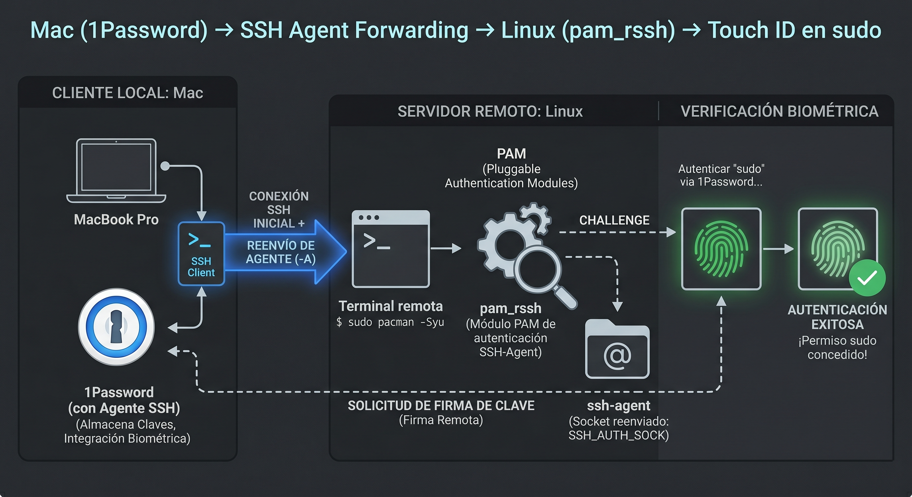
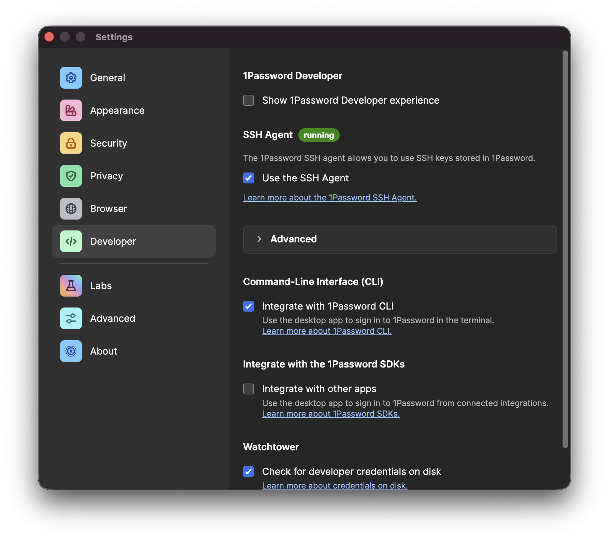

**TL;DR**: With 1Password's SSH agent, `ForwardAgent yes` on the Mac, and `pam_rssh` on Linux, you can use Touch ID to authenticate on remote servers — including `sudo`.

---

Since I switched from Windows to Linux on my main PC, I've come to realise that while it's a surprisingly capable workstation and gaming machine, I increasingly use it more as a server than as a traditional desktop. I "connect" to it more often than I "sit" in front of it.

So far I've managed to migrate my entire Generative AI stack ([ComfyUI](https://comfy.org/) and [vLLM](https://vllm.ai/)), agentic development ([Claude Code](https://claude.com/product/claude-code)) and more traditional development to this machine, though I get the feeling I've barely scratched the surface of what's possible with this setup.

The experience has been tremendously **rewarding** and **educational**. It's forced me to dust off sysadmin knowledge from my days managing bare metal servers and VPS, learn new DevOps techniques, and discover a whole range of tools that make working in the terminal, in many cases, even more efficient than desktop applications.

One area where I've focused a lot is **reducing friction** when interacting with the server **without sacrificing security**. Until a few years ago this was limited to replacing password authentication with public keys. That helped, though it didn't spare me from typing passphrases. Password managers made it a bit more manageable, but it wasn't until biometric authentication (**Touch ID**) arrived that I really started to see the light.

One of the features I love most about [my password manager](https://1password.com/) is the built-in SSH agent, which enormously simplifies the secure use of key pairs. Until today I was only using it to authenticate with SSH servers, but something clicked in my head ([I blame constant updates](https://imgur.com/gallery/pacman-syu-H7sK5nq)) and I wondered:

> Can I use my Mac's Touch ID to authenticate as root on Linux?

I asked Gemini and it turns out: yes! So we got to work, and with a bit of Claude's help to clear the final hurdle, we pulled it off. Since even with AI assistance it wasn't entirely trivial, I've decided to document the process for anyone in the same situation.

## Goal

When `ssh`-ing into my Linux box (Arch, btw) from the Mac:

- Touch ID prompts for confirmation on the Mac when connecting
- The agent is **forwarded** to the remote server
- `sudo` on the server also uses Touch ID (via the forwarded agent)

## The complete stack



---

## 1. Enable the SSH agent in 1Password



In **1Password → Preferences → Developer**, enable:

- ✅ *Use the SSH agent*

The agent socket lives at:

```
~/.1password/agent.sock
```

---

## 2. Configure `~/.ssh/config` on the Mac

```sshconfig
Host *
  IdentityAgent ~/.1password/agent.sock
  ServerAliveInterval 30

Host linux
  HostName 192.168.1.42
  User javi
  ForwardAgent yes
```

The `Host *` block makes all hosts use the 1Password agent by default. `ForwardAgent yes` on the specific host is what allows the agent to travel to the remote server.

**Note** that `ForwardAgent yes` is only in the `linux` host block, not in the catch-all (`*`). This is intentional — forwarding your agent to any server is not recommended, as a compromised server could use your keys to impersonate you.

**Watch out for ControlMaster:** if you have `ControlMaster auto` in a more general block that also matches this host, the control socket is created with the settings from the first match. Make sure `ForwardAgent yes` is also in that more general block, or forwarding will never activate (if that last sentence was gibberish to you, you can ignore it).

---

## 3. Configure the Linux server

### `/etc/ssh/sshd_config.d/99-custom.conf`

```
KbdInteractiveAuthentication no
UsePAM yes
PrintMotd no
AllowAgentForwarding yes
StreamLocalBindUnlink yes
```

- `AllowAgentForwarding yes`: essential for the server to accept the forwarded agent
- `StreamLocalBindUnlink yes`: removes stale Unix sockets on reconnect; prevents failures when a previous session didn't close cleanly
- `KbdInteractiveAuthentication no`: disables password prompts; if you're using keys only, this is good security practice

### `/etc/pam.d/sudo`

```
#%PAM-1.0
auth      sufficient  pam_rssh.so
auth      include     system-auth
account   include     system-auth
session   include     system-auth
```

`pam_rssh` is what allows PAM to authenticate using the forwarded SSH agent. With `sufficient`, if the agent responds correctly — meaning Touch ID is confirmed on the Mac — no password is requested. It's available in the AUR:

```bash
paru -S pam_rssh
```

### `/etc/sudoers` (via `visudo`)

```
Defaults env_keep += "SSH_AUTH_SOCK"
```

By default `sudo` strips environment variables, so `SSH_AUTH_SOCK` would disappear before `pam_rssh` could read it. This line preserves it.

---

## 4. The stupid mistake

After configuring everything above, agent forwarding still wasn't working. `$SSH_AUTH_SOCK` on the server was pointing to `/run/user/1000/ssh-agent.socket` (a non-existent socket) instead of the actual forwarded socket.

I ruled out causes one by one:

```bash
# Is any systemd service interfering?
systemctl --user status ssh-agent.socket
# → disabled and dead ✓

# Is the variable hardcoded in the systemd environment?
systemctl --user show-environment | grep SSH
# → nothing ✓

# Is it in the shell config?
grep -r SSH_AUTH_SOCK ~/.zshrc ~/.zprofile ~/.zlogin ~/.zshenv
# → /home/javi/.zshenv: export SSH_AUTH_SOCK="$XDG_RUNTIME_DIR/ssh-agent.socket"
```

There it was. A line in `.zshenv` was overwriting `SSH_AUTH_SOCK` **every time**, even after SSH had set it correctly. Since `.zshenv` is sourced in all zsh contexts (interactive, non-interactive, login, non-login), it always won — silently.


The fix was simply removing that line. I had added it at some point for a systemd agent I no longer use and completely forgotten about it. You probably won't hit exactly this issue, but if forwarding isn't working, the first thing you should check is whether something in your shell config is overwriting that variable.

---

## 5. Verification

After reconnecting:

```bash
echo $SSH_AUTH_SOCK
# /home/javi/.ssh/agent/s.uRkD2K0GuL.sshd.3m8Qqcp00S  ✓

ssh-add -l
# 256 SHA256:xxxx... javi@mac (ED25519)  ✓

sudo ls /root
# → Touch ID prompt on the Mac ✓
```

---

## Summary of modified files

| File | What it does |
|---|---|
| Mac: `~/.ssh/config` | Points to 1Password socket, enables ForwardAgent |
| Linux: `sshd_config.d/` | Enables AllowAgentForwarding |
| Linux: `/etc/pam.d/sudo` | Uses pam_rssh to authenticate with the agent |
| Linux: `/etc/sudoers` | Preserves SSH_AUTH_SOCK when invoking sudo |
| Linux: `~/.zshenv` | **Remove** any SSH_AUTH_SOCK export |

---

## Conclusion

The process itself isn't especially complex, but it has plenty of points where it can fail silently. The configuration can be one hundred percent correct and still not work because of something completely unrelated — like an environment variable being overwritten in the shell. That's what makes this kind of debugging so frustrating, and so satisfying when it finally clicks into place.

If you're setting this up and can't get it working, start with the basics: check that `$SSH_AUTH_SOCK` on the server points to something real and that no shell config file is overwriting it. From there, the rest is usually much more straightforward.

And if you reach the point where Touch ID on your Mac unlocks a `sudo` on your Linux server, take a moment to appreciate the achievement — **because it's genuinely cool**.
