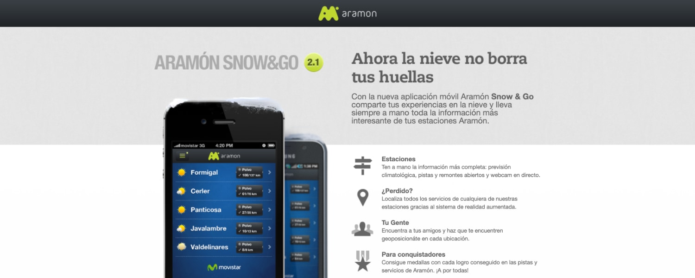

**Aramón Snow & Go** was a mobile companion application for **Aramón** ski resorts, developed for **Movistar**.

As **Technical Advisor** and **Backend Developer** at **Neo Labels**, I contributed to the technical architecture and backend development of the application.

## Platforms

- **Android**
- **BlackBerry**
- **iOS**

