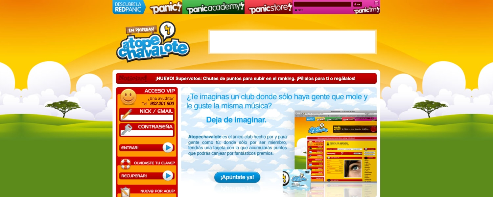

**Atopechavalote!** was the social network of **Sharemusic!**, a nightlife event organizer in Madrid. It was one of the first social networking platforms in Spain, running from 2005 to 2010 and reaching **25,000 registered users** at its peak.

I joined the project in 2007 as **Full Stack Developer** and **UI Designer**, and stayed until 2009:
- Performed a complete code rewrite of the platform.
- Redesigned the UI and overall user experience.
- Developed community features allowing users to connect around events, music, and nightlife culture.

## Technologies

- **PHP** with **CodeIgniter** as the web framework.
- **MySQL** as the database.

