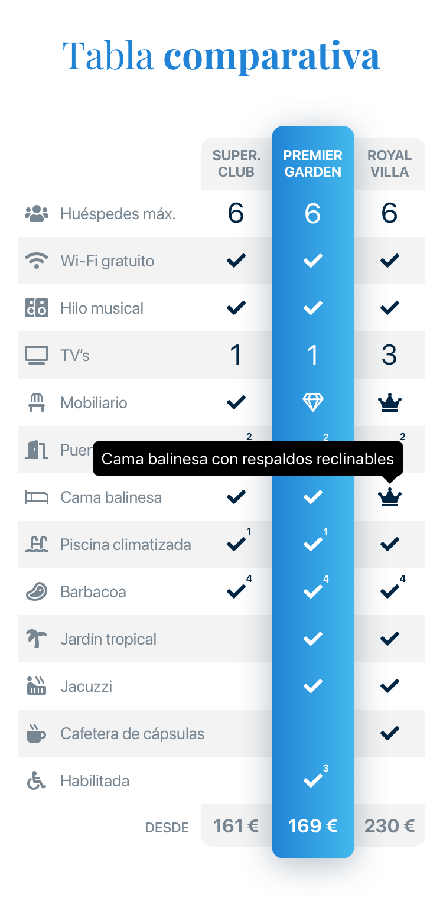
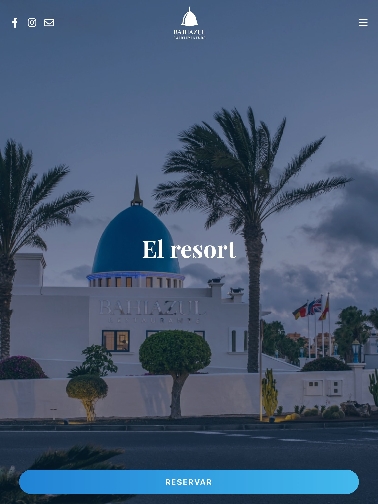
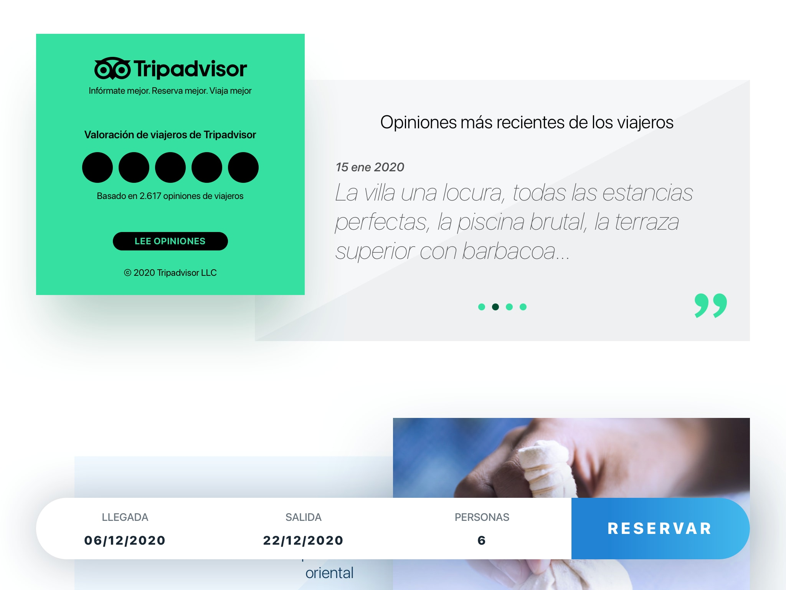
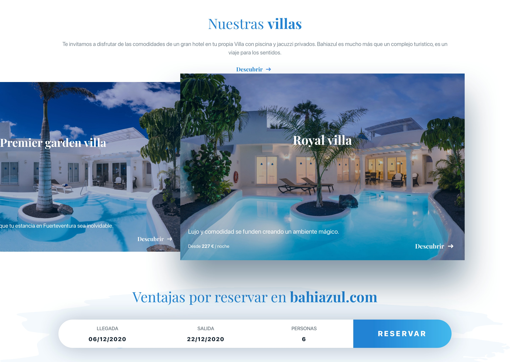

The **Bahiazul Website** redesign served as the resort's primary online presence, historically responsible for more than 50% of its bookings.

The goal of the project was to overhaul the outdated 2013 version and replace it with a high-performance web platform focused on a mobile-first approach, a more intuitive and personalized booking experience, and a clean and modern design.

## Key Features & Implementation

As the **Full Stack Developer**, I led the technical development:
- Built the platform using **Next.js** and **TypeScript** to achieve server-side rendering (SSR) and strong SEO performance.
- Used **Firebase Hosting** and **Cloud Functions** for deployment and server rendering logic.
- Incorporated **Sass** for bespoke, responsive styling based on a custom internal **Design System**.
- Implemented rich media integrations including cinemagraphs, video banners, and **360º interactive photo elements** hosted on **Firebase Storage**.
- Used **MDX** for flexible static content editing.

