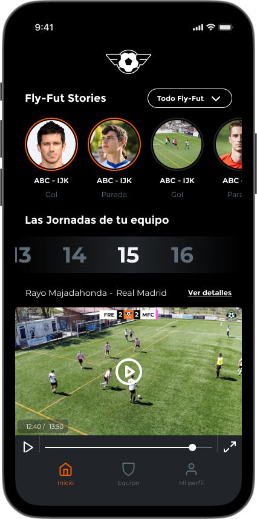

**Fly-Fut Ligas** is the company's consumer product. It allows amateur football teams to have their matches professionally recorded and produced using drones, and subsequently view and share highlights through a mobile app.

The platform is composed of a consumer-facing mobile application, a cloud-based video production pipeline, and internal administrative and management tools.

## Architecture & Implementation

As **System Architect** and **Backend Developer**, I solely designed and developed the entire backend infrastructure of the platform.

Key implementation details:

- Modular REST API in **NestJS** with three distinct scopes (mobile app, back-office, and internal services), each with its own authentication strategy using **Firebase Auth** and configurable **RBAC** with a hierarchical role tree.
- Full domain model in **PostgreSQL** and **TypeORM** (85 entities, 175 migrations), following **DDD** principles with APIs documented via **OpenAPI**.
- Dual payment and subscription system integrating **Stripe** (Android) and **Apple In-App Purchases** (iOS), with webhooks, state reconciliation, and automated expiration management.
- Video production pipeline on **Google Cloud Platform** automating recording, processing, and publishing.
- Three fully isolated environments (dev/staging/production) with CI/CD on **Cloud Build** and runtime secret management via **GCP Secret Manager**.

