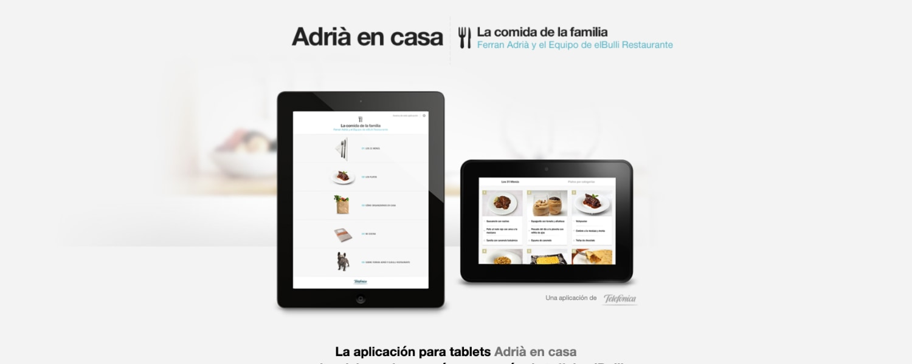

**Adrià en casa** fue una aplicación móvil de cocina desarrollada para **Telefónica**, en colaboración con el chef de fama mundial **Ferran Adrià**.

Como **Asesor Técnico** en **Neo Labels**, aporté consultoría técnica a lo largo del desarrollo de la aplicación.

## Plataformas

- **Android**
- **iPadOS**

