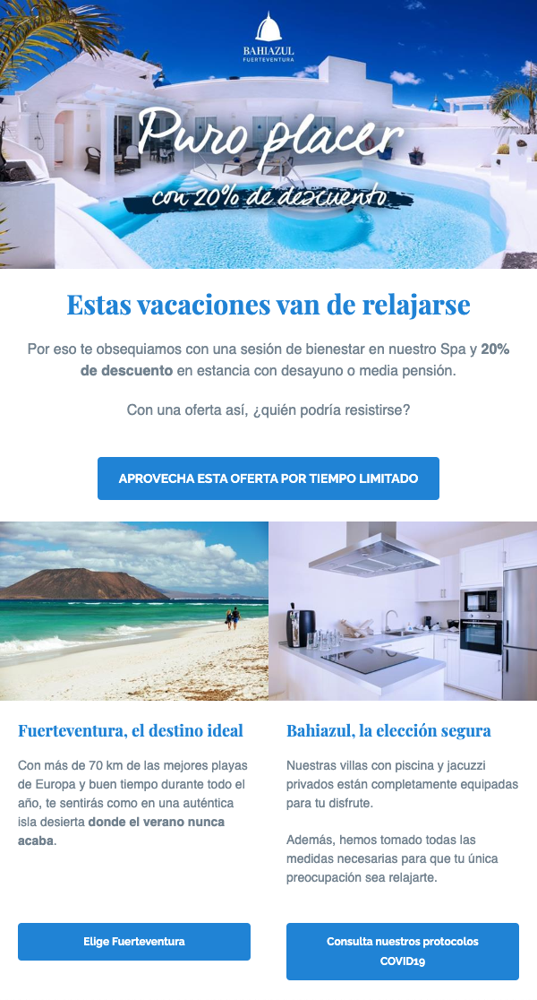
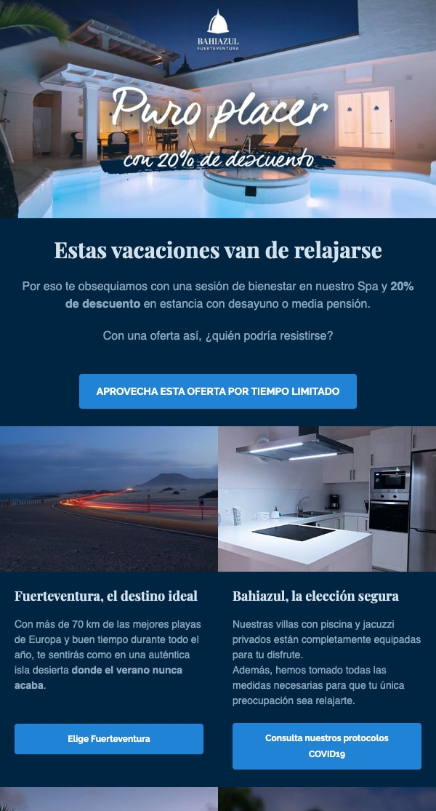
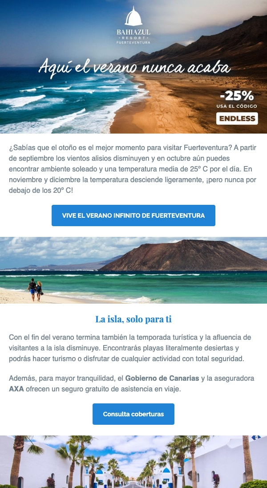
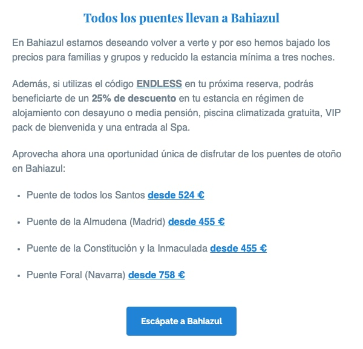

Durante mi etapa en **Bahiazul Resort**, lideré una serie de **campañas de email marketing** segmentadas con el objetivo de atraer huéspedes de vuelta al resort tras las disrupciones causadas por la pandemia de COVID-19.

Como **Consultor Tecnológico**, fui responsable de la estrategia técnica, la configuración y la optimización de las campañas.

## Enfoque

- **A/B Testing** para identificar los mensajes y asuntos más efectivos.
- **Segmentación** y **Contenido Dinámico** para adaptar los mensajes a diferentes perfiles de huéspedes.
- Flujos de **Automatización** para enviar seguimientos personalizados en el momento oportuno.
- **Analítica** para medir el rendimiento de las campañas e iterar sobre los resultados.

## Herramientas

- **Campaign Monitor** para el envío y la gestión de las campañas.

