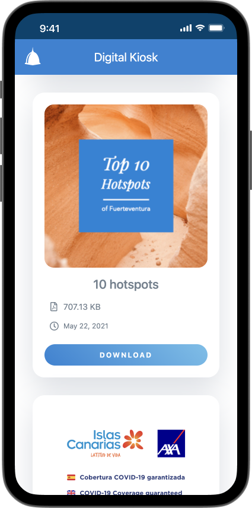

**El Quiosco Digital de Bahiazul** es una aplicación web mobile-first desarrollada para **Bahiazul Resort** con el fin de reemplazar los materiales impresos físicos por una alternativa digital.

Los huéspedes escanean códigos QR distribuidos por el resort para acceder a folletos, mapas, información de actividades y otros materiales directamente en sus dispositivos.

Como **Diseñador UX/UI** y **Desarrollador Frontend**, fui responsable tanto del diseño como del desarrollo de la aplicación.

## Tecnologías

- **Svelte** para construir la aplicación de página única, elegido por su velocidad y ligereza.
- **Firebase** para el hosting y los servicios backend.
- **Sketch** para el diseño UI.

