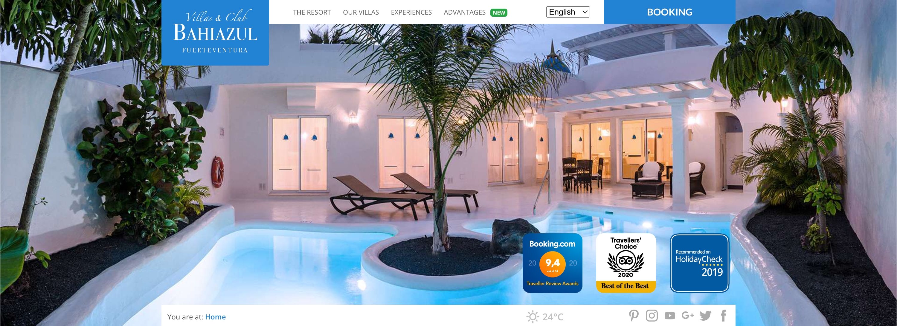

La primera versión del sitio web de **Bahiazul Resort** fue desarrollada como la presencia digital principal y la plataforma de reservas de la empresa.

Como **Desarrollador Full Stack** y **Diseñador UI**, fui responsable tanto del diseño como de la implementación técnica de la plataforma desde cero.

## Diseño

Diseñé la identidad visual y la interfaz de usuario del sitio web con **Sketch**, con un enfoque en mostrar el entorno y las instalaciones únicas del resort.

## Desarrollo

Construí la plataforma con un stack tradicional del lado del servidor:
- **PHP** con **CodeIgniter** como framework web.
- **jQuery** para la interactividad frontend.

Este sitio web fue posteriormente reemplazado por una [versión 2](/es/projects/bahiazul-website) construida con Next.js y TypeScript.

