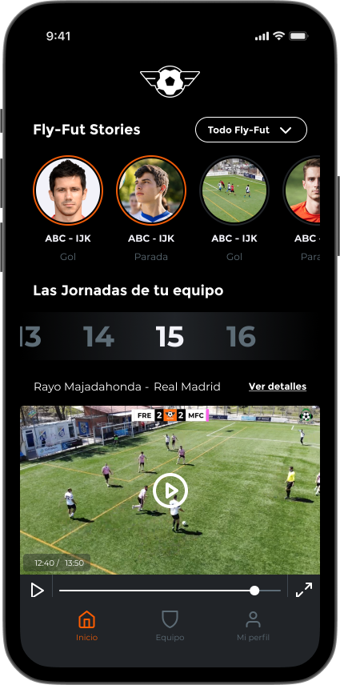

**Fly-Fut Ligas** es el producto de consumo de la empresa. Permite a equipos de fútbol aficionado tener sus partidos grabados y producidos profesionalmente utilizando drones, y posteriormente ver y compartir los momentos destacados con familiares y amigos a través de una aplicación móvil.

La plataforma está compuesta por:
- Una aplicación móvil orientada al consumidor.
- Un pipeline de creación de vídeo en la nube asistido por IA.
- Herramientas internas de administración y gestión.

## Arquitectura e Implementación

Como **Arquitecto de Sistemas** y **Desarrollador Backend**, fui responsable de diseñar y desarrollar toda la infraestructura backend de la plataforma de consumo.

Aspectos clave de la implementación:
- Construcción de los servicios backend principales utilizando **NestJS** y **TypeScript**, adhiriéndose a los principios de **Diseño Guiado por el Dominio (DDD)** y asegurando las APIs con especificaciones **OpenAPI**.
- Desarrollo del pipeline de vídeo que automatiza la ingesta, codificación y publicación de vídeos utilizando **Google Cloud Platform**.
- Creación de un **pipeline de IA** para detectar eventos relevantes de los partidos a partir de la grabación de vídeo en bruto, acelerando el proceso de generación de resúmenes.
- Implementación de sincronización en tiempo real y almacenamiento de bases de datos con **Firebase** y **PostgreSQL**.

