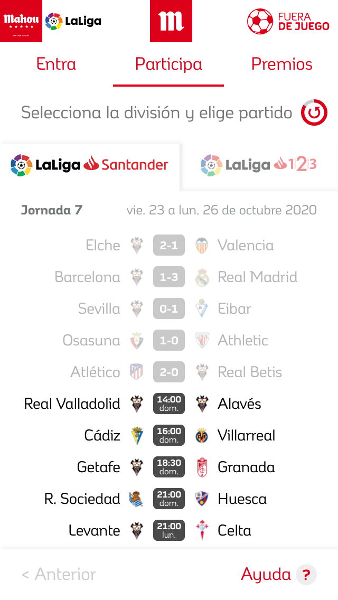
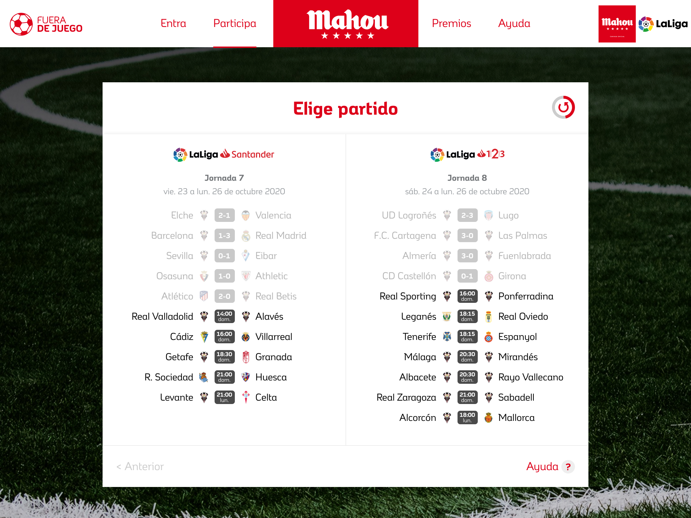

**Fuera de Juego** fue una aplicación web promocional desarrollada para **Mahou** con el fin de involucrar a los aficionados al fútbol durante la temporada de LaLiga.

La aplicación permitía a los usuarios enviar códigos promocionales encontrados en las botellas de cerveza Mahou para predecir los resultados de los próximos partidos de LaLiga, subir en la clasificación y ganar premios.

## Arquitectura y Desarrollo

Como **Desarrollador Frontend** dentro de un equipo de cinco desarrolladores, trabajé en:

- Construcción de una **SPA (Single Page Application) mobile-first** utilizando **React** y **Redux** para la gestión del estado.
- Integración del frontend con una API backend basada en **LoopBack 3**.
- Conexión de resultados de partidos en tiempo real mediante la **API de BeSoccer**.
- Integración de la API de autenticación de Mahou para una validación segura de los usuarios.

