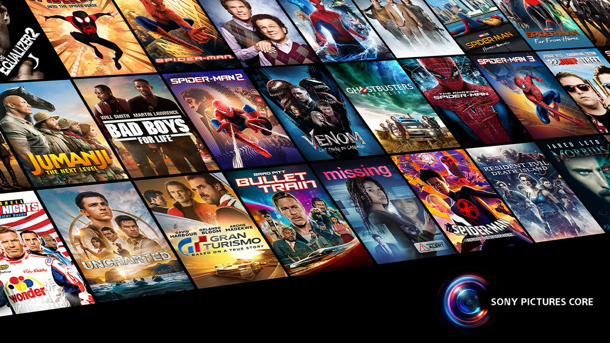

**Sony Pictures Spain** es la plataforma web desarrollada para la división española de **Sony Pictures**.

Como **Tech Lead** y **Desarrollador Full Stack** en **Interacso**, lideré el diseño y el desarrollo de la plataforma.

## Tecnologías

- **Next.js** y **React** para el frontend.
- **Strapi** como headless CMS.
- **PostgreSQL** como base de datos.
- **Tailwind CSS** para los estilos.
- **TypeScript** en todo el stack.

