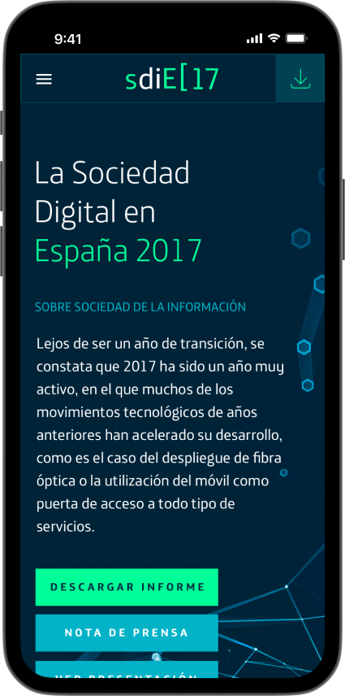
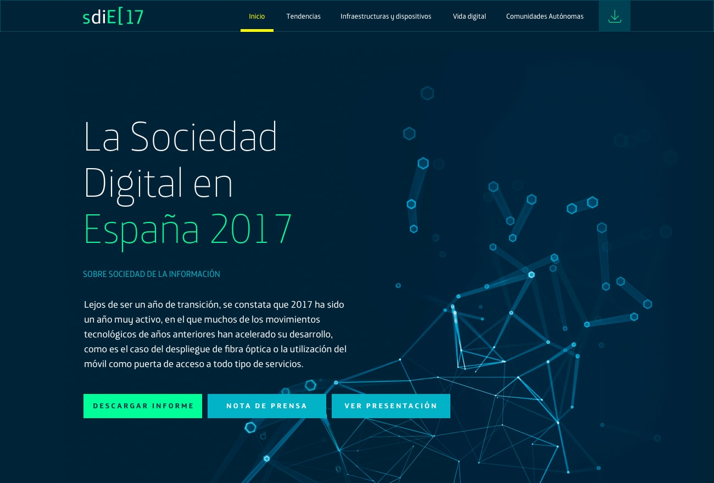
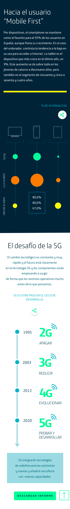
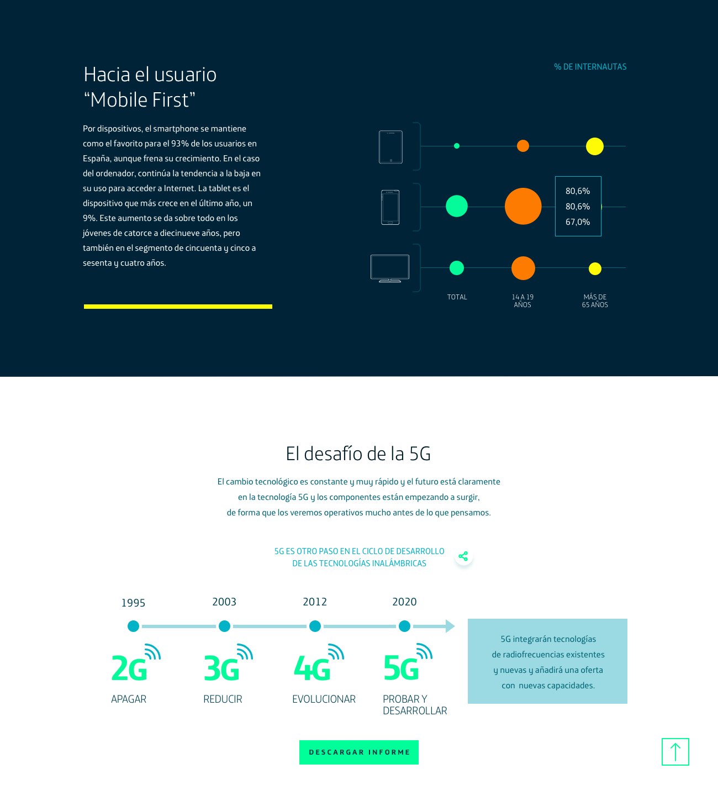

**Telefónica SDiE 2017** fue una aplicación web interactiva desarrollada para **Fundación Telefónica** para presentar los datos y conclusiones de su informe anual sobre la sociedad digital en España.

Como **Desarrollador Frontend** en **Piensa Diferente**, construí una aplicación de página única que daba vida a los datos del informe mediante gráficos y visualizaciones interactivas.

## Tecnologías

- **React** para la aplicación de página única.
- **Recharts** para la visualización de datos y los gráficos interactivos.

