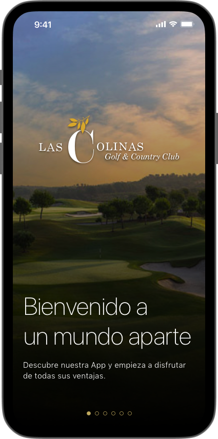
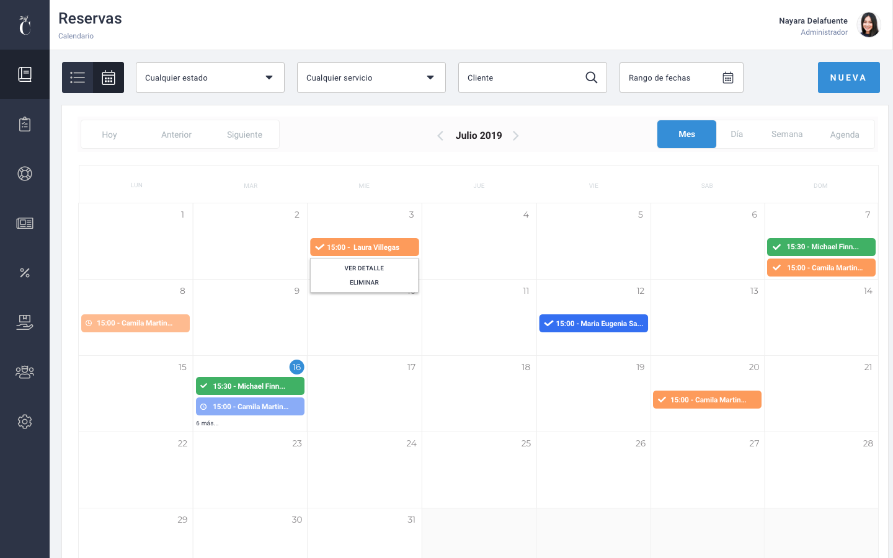

**Un Mundo Aparte** fue una aplicación móvil desarrollada para **Las Colinas Golf & Country Club**, un exclusivo resort de golf y country club en Alicante, España.

La aplicación servía como compañero digital para los huéspedes, proporcionando acceso a los servicios, actividades e información del resort durante su estancia.

## Mi Rol

Como **Líder Técnico** y **Líder de UX**, fui responsable de:

- La arquitectura del sistema y la dirección técnica general del proyecto.
- El diseño UX del backoffice de gestión.
- La dirección del equipo de desarrollo.

## Tecnologías

- **React Native** para el desarrollo móvil multiplataforma.
- **LoopBack** para la API backend.
- **Sketch** para el diseño UX/UI.

